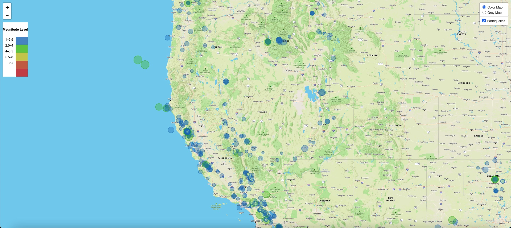

# leaflet-challenge
Armando Cota's submission for Module 15 Assignment 

### Click here to view the website via github pages!
https://tonycota.github.io/leaflet-challenge/

Within this repository you will find HTML, CSS and JS files interacting with one another to develop a user friendly and interactive page displaying Earthquakes from USGS. Drawing information from this website and creating an interactive map that shows Earthquakes from the past 7 days. Feel free to follow the link above and interact with the page yourself! Also below is a screenshot of what to expect upon clicking the link. The page shows markers varying on magnitude size of earthquakes, and once clicking shows popup information regarding location, size and time of occurence. 

### Instructions for the Assignment
Part 1: Create the Earthquake Visualization
2-BasicMap

Your first task is to visualize an earthquake dataset. Complete the following steps:

Get your dataset. To do so, follow these steps:

The USGS provides earthquake data in a number of different formats, updated every 5 minutes. Visit the USGS GeoJSON FeedLinks to an external site. page and choose a dataset to visualize. The following image is an example screenshot of what appears when you visit this link:
3-Data

When you click a dataset (such as "All Earthquakes from the Past 7 Days"), you will be given a JSON representation of that data. Use the URL of this JSON to pull in the data for the visualization. The following image is a sampling of earthquake data in JSON format:
4-JSON

Import and visualize the data by doing the following:

Using Leaflet, create a map that plots all the earthquakes from your dataset based on their longitude and latitude.

Your data markers should reflect the magnitude of the earthquake by their size and the depth of the earthquake by color. Earthquakes with higher magnitudes should appear larger, and earthquakes with greater depth should appear darker in color.

Hint: The depth of the earth can be found as the third coordinate for each earthquake.

Include popups that provide additional information about the earthquake when its associated marker is clicked.

Create a legend that will provide context for your map data.

Your visualization should look something like the preceding map.